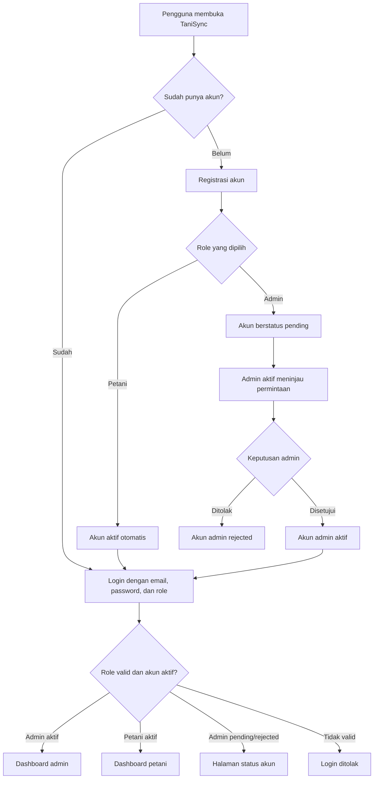
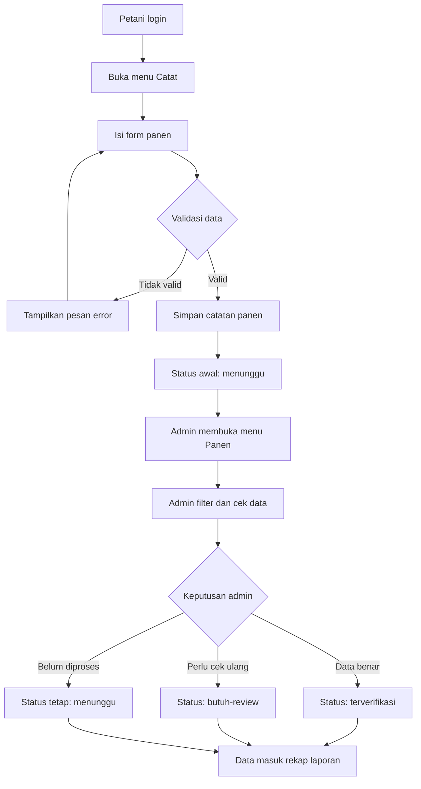
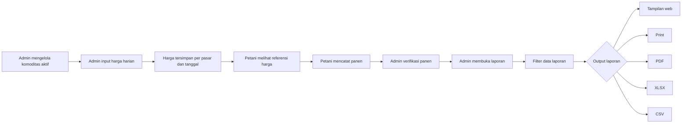
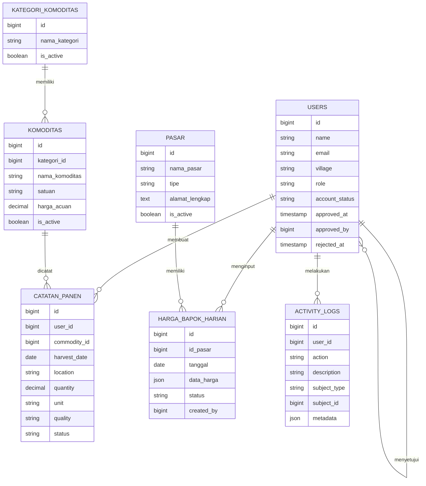

# TaniSync

TaniSync adalah aplikasi web berbasis Laravel untuk digitalisasi pencatatan panen dan harga komoditas pertanian di tingkat desa, kelompok tani, atau gapoktan. Aplikasi ini membantu petani mencatat hasil panen pribadi, melihat referensi harga terbaru, dan membantu admin mengelola data komoditas, harga harian, verifikasi panen, laporan, serta audit aktivitas sistem.

Dokumen ini disusun sebagai README sekaligus bahan awal buku panduan penggunaan TaniSync. Bagian awal menjelaskan gambaran sistem dan cara menjalankan project, sedangkan bagian berikutnya menjelaskan panduan operasional untuk admin dan petani.

## Daftar Isi

- [Hasil Review Website](#hasil-review-website)
- [Gambaran Umum Sistem](#gambaran-umum-sistem)
- [Role Pengguna](#role-pengguna)
- [Fitur Utama](#fitur-utama)
- [Flowchart Sistem](#flowchart-sistem)
- [Panduan Instalasi Lokal](#panduan-instalasi-lokal)
- [Akun Demo](#akun-demo)
- [Panduan Penggunaan Admin](#panduan-penggunaan-admin)
- [Panduan Penggunaan Petani](#panduan-penggunaan-petani)
- [Struktur Database](#struktur-database)
- [Route Utama](#route-utama)
- [Validasi dan Keamanan](#validasi-dan-keamanan)
- [Testing dan Build](#testing-dan-build)
- [Catatan Pengembangan Selanjutnya](#catatan-pengembangan-selanjutnya)

## Hasil Review Website

Berdasarkan penelusuran struktur route, controller, view, migration, seeder, service, export, dan test, TaniSync sudah berada pada tahap MVP demo yang cukup matang. Website sudah memiliki alur role yang jelas, dashboard terpisah untuk admin dan petani, validasi data inti, audit log, filter data, pagination, serta ekspor laporan.

Ringkasan hasil review:

| Area | Status | Catatan |
| --- | --- | --- |
| Landing page | Sudah tersedia | Menampilkan hero visual, CTA registrasi/login, dan ringkasan fitur utama. |
| Autentikasi | Sudah tersedia | Login memakai email, password, dan pilihan role. Role yang salah akan ditolak. |
| Registrasi | Sudah tersedia | Petani aktif langsung. Admin baru masuk status pending dan perlu disetujui admin aktif. |
| Dashboard admin | Sudah tersedia | Menampilkan metrik petani, panen bulan ini, admin pending, panen menunggu, tren, distribusi, dan aktivitas terbaru. |
| Dashboard petani | Sudah tersedia | Menampilkan ringkasan panen pribadi, komoditas aktif, harga terakhir, riwayat, tren, dan harga terbaru. |
| Komoditas | Sudah tersedia | Admin dapat tambah, edit, aktif/nonaktif, cari, filter status, dan melihat pagination. |
| Harga harian | Sudah tersedia | Admin dapat menyimpan harga per pasar dan tanggal, dengan status draft/submitted/verified. |
| Catatan panen | Sudah tersedia | Petani dapat membuat catatan panen. Admin dapat memantau dan mengubah status. |
| Laporan | Sudah tersedia | Mendukung filter, KPI ringkas, print, export PDF, export XLSX, dan export CSV. |
| Audit log | Sudah tersedia | Aktivitas penting seperti persetujuan admin, perubahan komoditas, harga, panen, dan export laporan tercatat. |
| Testing | Sudah tersedia | Terdapat feature test untuk keamanan data, alur laporan, filter, export, dan auth dasar. |

Catatan batasan MVP saat ini:

- Manajemen kategori komoditas belum memiliki halaman khusus. Data kategori masih disiapkan melalui seeder.
- Manajemen pasar belum memiliki halaman khusus. Data pasar masih disiapkan melalui seeder.
- Upload gambar komoditas/pasar belum menjadi fitur operasional, meskipun kolom database untuk gambar sudah tersedia.
- Belum ada fitur edit catatan panen dari sisi petani setelah data dikirim.
- Belum ada notifikasi real-time untuk admin ketika petani mengirim catatan panen baru.
- Grafik dashboard masih sederhana dan berbasis ringkasan data internal.

## Gambaran Umum Sistem

TaniSync menghubungkan dua aktivitas utama:

1. Petani mencatat data panen dan melihat referensi harga.
2. Admin mengelola data master, memverifikasi panen, dan membuat laporan.

Data yang dicatat petani tersimpan ke database dengan status awal `menunggu`. Admin kemudian meninjau data tersebut dan menentukan apakah catatan panen sudah `terverifikasi` atau masih `butuh-review`. Data panen yang terkumpul dapat difilter dan diekspor menjadi laporan.

Tujuan utama TaniSync:

- Mengurangi pencatatan panen manual.
- Menyediakan data harga komoditas yang mudah dilihat petani.
- Membantu admin desa/gapoktan memantau produksi panen.
- Menyediakan laporan panen yang siap dicetak atau diekspor.
- Memisahkan akses sistem berdasarkan role pengguna.
- Menyediakan dasar pengembangan sistem informasi pertanian desa.

## Role Pengguna

### Admin

Admin adalah pengelola sistem di tingkat desa/gapoktan. Admin bertanggung jawab terhadap validitas data master, harga, panen, akses admin baru, dan laporan.

Hak akses admin:

- Masuk ke dashboard admin.
- Melihat ringkasan operasional desa.
- Menyetujui atau menolak pendaftaran admin baru.
- Melihat audit aktivitas sistem.
- Mengelola data komoditas.
- Menginput harga harian komoditas.
- Melihat dan memfilter seluruh catatan panen petani.
- Mengubah status verifikasi panen.
- Melihat laporan panen.
- Mencetak laporan.
- Mengekspor laporan ke PDF, XLSX, dan CSV.

### Petani

Petani adalah pengguna yang mencatat hasil panennya sendiri dan melihat harga komoditas terbaru.

Hak akses petani:

- Masuk ke dashboard petani.
- Melihat ringkasan panen pribadi.
- Melihat referensi harga komoditas.
- Mencatat panen baru.
- Melihat riwayat panen pribadi.
- Mencari dan memfilter riwayat panen pribadi.
- Melihat status verifikasi data panen.

## Fitur Utama

### 1. Landing Page

Halaman utama berada pada route `/`. Halaman ini mengenalkan TaniSync sebagai platform pertanian desa, menyediakan tombol `Mulai Gratis`, tombol `Masuk`, dan ringkasan fitur utama.

### 2. Autentikasi Berbasis Role

Login TaniSync membutuhkan:

- Email.
- Password.
- Role akun, yaitu `admin` atau `petani`.

Sistem akan menolak login jika role yang dipilih tidak sesuai dengan akun. Contohnya, akun petani tidak dapat masuk jika pengguna memilih role admin.

### 3. Registrasi Akun

Saat registrasi, pengguna memilih role:

- `petani`: akun langsung aktif dan diarahkan ke dashboard petani.
- `admin`: akun masuk status `pending` dan harus disetujui oleh admin aktif.

Status akun admin:

| Status | Arti |
| --- | --- |
| `pending` | Admin baru sudah mendaftar, tetapi belum disetujui. |
| `active` | Admin sudah disetujui dan dapat mengakses dashboard admin. |
| `rejected` | Permintaan akses admin ditolak. |

### 4. Dashboard Admin

Dashboard admin menampilkan:

- Jumlah petani aktif.
- Total panen bulan berjalan.
- Jumlah admin yang menunggu persetujuan.
- Jumlah panen yang masih menunggu verifikasi.
- Tren panen bulanan.
- Distribusi panen per komoditas.
- Aktivitas sistem terbaru.

Dashboard ini menjadi halaman awal admin untuk memantau kondisi sistem.

### 5. Dashboard Petani

Dashboard petani menampilkan:

- Total panen pribadi bulan berjalan.
- Jumlah komoditas aktif.
- Harga komoditas terakhir.
- Jumlah riwayat panen pribadi.
- Tren panen pribadi.
- Beberapa harga terbaru.

Dashboard ini dirancang agar petani langsung mengetahui status panen dan harga komoditas penting.

### 6. Manajemen Komoditas

Admin dapat mengelola master data komoditas melalui menu `Komoditas`.

Data komoditas berisi:

- Nama komoditas.
- Kategori komoditas.
- Satuan.
- Harga acuan.
- Status aktif/nonaktif.

Komoditas aktif akan muncul di form harga dan form pencatatan panen. Komoditas nonaktif tidak dapat digunakan untuk input baru.

### 7. Harga Harian Komoditas

Admin dapat memperbarui harga komoditas berdasarkan pasar dan tanggal.

Data harga harian berisi:

- Pasar.
- Tanggal.
- Harga per komoditas aktif.
- Status harga: `draft`, `submitted`, atau `verified`.

Harga terbaru akan ditampilkan kepada petani sebagai referensi. Jika belum ada harga harian untuk sebuah komoditas, sistem dapat menggunakan harga acuan komoditas.

### 8. Catatan Panen Petani

Petani dapat mencatat panen melalui menu `Catat`.

Data yang diisi:

- Komoditas.
- Tanggal panen.
- Lokasi atau blok lahan.
- Jumlah panen.
- Satuan.
- Kualitas.
- Catatan tambahan.

Setelah disimpan, data akan masuk ke tabel `catatan_panen` dengan status awal `menunggu`.

### 9. Verifikasi Panen oleh Admin

Admin dapat membuka menu `Panen` untuk melihat seluruh catatan panen petani.

Status panen:

| Status | Arti |
| --- | --- |
| `menunggu` | Data baru masuk dan belum diverifikasi. |
| `terverifikasi` | Data sudah diperiksa dan disetujui admin. |
| `butuh-review` | Data perlu dicek ulang atau perlu klarifikasi. |

Admin dapat memfilter catatan berdasarkan petani, komoditas, status, tanggal, dan kata kunci.

### 10. Laporan Panen

Menu `Laporan` menyediakan rekap panen yang dapat difilter dan diekspor.

Filter laporan:

- Tanggal awal.
- Tanggal akhir.
- Komoditas.
- Petani.
- Status panen.
- Kata kunci.

Ringkasan laporan:

- Total kuantitas panen.
- Jumlah catatan.
- Jumlah data terverifikasi.
- Jumlah data menunggu.
- Jumlah data butuh review.
- Komoditas dominan.

Format output laporan:

- Tampilan web.
- Print view.
- PDF.
- Excel `.xlsx`.
- CSV kompatibel Excel.

### 11. Audit Aktivitas

TaniSync mencatat aktivitas penting ke tabel `activity_logs`, seperti:

- Pendaftaran admin pending.
- Persetujuan atau penolakan admin.
- Penambahan/perubahan komoditas.
- Perubahan status komoditas.
- Penyimpanan harga harian.
- Pembuatan catatan panen.
- Perubahan status panen.
- Pembukaan print laporan.
- Export PDF, XLSX, dan CSV.

Audit log membantu admin melacak riwayat penggunaan sistem.

## Flowchart Sistem

Flowchart berikut dapat digunakan sebagai bahan buku panduan. GitHub dan banyak editor Markdown modern dapat merender diagram Mermaid ini secara otomatis.

### Alur Akses Pengguna



### Alur Pencatatan dan Verifikasi Panen



### Alur Harga dan Laporan



### ERD Sederhana



## Teknologi yang Digunakan

| Komponen | Teknologi |
| --- | --- |
| Backend | Laravel 12 |
| Bahasa backend | PHP 8.2+ |
| Database | MySQL/MariaDB |
| Auth | Laravel Breeze |
| Template | Blade |
| Styling | Tailwind CSS |
| Frontend build | Vite |
| Interaksi ringan | Alpine.js |
| PDF export | barryvdh/laravel-dompdf |
| Excel export | maatwebsite/excel |
| Testing | PHPUnit / Laravel Test |

## Panduan Instalasi Lokal

### 1. Prasyarat

Pastikan perangkat memiliki:

- PHP 8.2 atau lebih baru.
- Composer.
- Node.js dan npm.
- MySQL atau MariaDB.
- XAMPP/phpMyAdmin jika menggunakan lingkungan lokal berbasis XAMPP.

### 2. Buka Folder Project

```bash
cd D:\Semester_6\capstoneProject\TaniSync
```

### 3. Install Dependency PHP

```bash
composer install
```

### 4. Install Dependency Frontend

```bash
npm install
```

### 5. Siapkan File Environment

Jika file `.env` belum ada, salin dari `.env.example`.

```bash
copy .env.example .env
```

Generate application key:

```bash
php artisan key:generate
```

### 6. Konfigurasi Database

Konfigurasi default yang digunakan untuk database lokal:

```env
DB_CONNECTION=mysql
DB_HOST=127.0.0.1
DB_PORT=3306
DB_DATABASE=tanisync
DB_USERNAME=root
DB_PASSWORD=
```

Buat database `tanisync` terlebih dahulu melalui phpMyAdmin atau MySQL client.

### 7. Jalankan Migration dan Seeder

```bash
php artisan migrate:fresh --seed
```

Perintah ini akan:

- Menghapus tabel lama.
- Membuat ulang tabel.
- Mengisi data demo awal.

### 8. Jalankan Server Laravel

```bash
php artisan serve
```

URL default:

```text
http://127.0.0.1:8000
```

### 9. Jalankan Vite

Buka terminal kedua, lalu jalankan:

```bash
npm run dev
```

Untuk build asset production:

```bash
npm run build
```

### 10. Perintah Setup Alternatif

Project juga menyediakan script Composer:

```bash
composer run setup
```

Script tersebut menjalankan instalasi dependency, pembuatan `.env`, generate key, migration, npm install, dan build frontend. Pastikan database sudah tersedia sebelum menjalankan script ini.

## Akun Demo

Seeder menyediakan akun demo berikut.

### Admin

```text
Email: admin@tanisync.id
Password: password123
Role: admin
Status: active
```

### Petani 1

```text
Email: rahmat@tanisync.id
Password: password123
Role: petani
Status: active
```

### Petani 2

```text
Email: sari@tanisync.id
Password: password123
Role: petani
Status: active
```

## Data Awal Seeder

Data awal yang dibuat oleh seeder:

| Data | Jumlah | Catatan |
| --- | ---: | --- |
| Admin aktif | 1 | Admin Gapoktan. |
| Petani aktif | 2 | Bapak Rahmat dan Ibu Sari. |
| Kategori komoditas | 4 | Pangan, Hortikultura, Umbi-umbian, Palawija. |
| Komoditas | 5 | Padi Ciherang, Jagung Manis, Cabai Merah, Kentang Lokal, Kedelai. |
| Komoditas aktif | 4 | Kedelai disiapkan sebagai contoh nonaktif. |
| Pasar | 1 | Pasar Desa Sukamaju. |
| Harga harian | 2 | Data harga hari ini dan kemarin. |
| Catatan panen | 4 | Status campuran: terverifikasi, menunggu, butuh-review. |

## Panduan Penggunaan Admin

### 1. Login sebagai Admin

1. Buka halaman `/login`.
2. Pilih role `Admin`.
3. Masukkan email dan password admin.
4. Klik tombol masuk.
5. Sistem mengarahkan ke `/admin/dashboard` jika akun admin aktif.

Jika akun admin masih `pending`, sistem mengarahkan ke `/account/pending`.

### 2. Membaca Dashboard Admin

Menu: `Beranda`

Dashboard admin berfungsi sebagai ringkasan cepat kondisi operasional.

Elemen penting:

| Bagian | Fungsi |
| --- | --- |
| Petani aktif | Jumlah akun petani yang terdaftar. |
| Total panen bulan ini | Akumulasi kuantitas panen pada bulan berjalan. |
| Admin menunggu | Jumlah admin baru yang perlu disetujui. |
| Panen menunggu | Jumlah catatan panen yang belum diverifikasi. |
| Tren bulanan | Visual ringkas perkembangan panen beberapa bulan terakhir. |
| Distribusi komoditas | Komoditas dengan kontribusi panen terbesar. |
| Aktivitas terbaru | Audit aktivitas terakhir di sistem. |

### 3. Menyetujui Admin Baru

Menu: `Akses`

Alur:

1. Buka menu `Akses`.
2. Periksa daftar admin dengan status `pending` atau `rejected`.
3. Klik aksi setujui jika admin boleh mengakses sistem.
4. Klik aksi tolak jika admin tidak diberi akses.
5. Sistem mencatat keputusan ke audit log.

Catatan:

- Hanya admin aktif yang dapat menyetujui admin lain.
- Admin yang sudah aktif tidak dapat diproses ulang melalui halaman ini.

### 4. Melihat Aktivitas Sistem

Menu: `Aktivitas`

Halaman ini menampilkan aktivitas sistem terbaru, termasuk perubahan data dan export laporan. Gunakan halaman ini untuk audit sederhana saat terjadi perubahan data yang perlu ditelusuri.

### 5. Mengelola Komoditas

Menu: `Komoditas`

Admin dapat:

- Menambah komoditas baru.
- Mengubah nama, kategori, satuan, dan harga acuan.
- Mengaktifkan atau menonaktifkan komoditas.
- Mencari komoditas berdasarkan nama atau kategori.
- Memfilter komoditas berdasarkan status aktif/nonaktif.

Langkah menambah komoditas:

1. Buka menu `Komoditas`.
2. Isi nama komoditas.
3. Pilih kategori.
4. Isi satuan, misalnya `kg`, `kuintal`, atau `ton`.
5. Isi harga acuan jika tersedia.
6. Simpan data.

Catatan:

- Komoditas baru otomatis aktif.
- Komoditas nonaktif tidak muncul pada form input harga dan form catatan panen baru.

### 6. Menginput Harga Harian

Menu: `Harga`

Langkah:

1. Buka menu `Harga`.
2. Pilih pasar.
3. Pilih tanggal harga.
4. Isi minimal satu harga komoditas aktif.
5. Pilih status harga: `draft`, `submitted`, atau `verified`.
6. Simpan.

Aturan validasi:

- Tanggal tidak boleh melebihi hari ini.
- Harga harus lebih dari 0.
- Harga maksimal `100000000`.
- Minimal satu harga komoditas aktif harus diisi.
- Harga hanya diproses untuk komoditas aktif.

Data harga harian disimpan unik per kombinasi pasar dan tanggal. Jika admin menyimpan harga untuk pasar dan tanggal yang sama, data lama akan diperbarui.

### 7. Memantau dan Memverifikasi Panen

Menu: `Panen`

Admin dapat:

- Melihat seluruh catatan panen petani.
- Memfilter berdasarkan petani.
- Memfilter berdasarkan komoditas.
- Memfilter berdasarkan status.
- Memfilter berdasarkan tanggal.
- Mencari berdasarkan lokasi, catatan, nama petani, atau nama komoditas.
- Mengubah status panen.

Langkah verifikasi:

1. Buka menu `Panen`.
2. Gunakan filter jika daftar data banyak.
3. Periksa detail panen: petani, komoditas, tanggal, lokasi, jumlah, satuan, kualitas, dan catatan.
4. Ubah status menjadi `terverifikasi` jika data sudah benar.
5. Ubah status menjadi `butuh-review` jika data perlu diklarifikasi.
6. Biarkan `menunggu` jika belum diproses.

### 8. Membuat Laporan

Menu: `Laporan`

Langkah:

1. Buka menu `Laporan`.
2. Atur filter sesuai kebutuhan.
3. Periksa KPI ringkas dan daftar data.
4. Gunakan print atau export jika laporan akan dibagikan.

Filter yang tersedia:

| Filter | Fungsi |
| --- | --- |
| Tanggal awal | Menampilkan panen mulai tanggal tertentu. |
| Tanggal akhir | Menampilkan panen sampai tanggal tertentu. |
| Komoditas | Membatasi laporan ke satu komoditas. |
| Petani | Membatasi laporan ke satu petani. |
| Status | Membatasi laporan berdasarkan status verifikasi. |
| Pencarian | Mencari lokasi, catatan, nama petani, atau nama komoditas. |

Output laporan:

| Output | Kegunaan |
| --- | --- |
| Web | Melihat laporan langsung di dashboard. |
| Print | Membuka versi cetak. |
| PDF | Mengunduh laporan siap kirim/cetak. |
| XLSX | Mengunduh data untuk Microsoft Excel atau spreadsheet lain. |
| CSV | Mengunduh data ringan yang kompatibel dengan Excel. |

Setiap aktivitas print/export laporan akan dicatat di audit log.

## Panduan Penggunaan Petani

### 1. Registrasi sebagai Petani

1. Buka halaman `/register`.
2. Pilih role `Petani`.
3. Isi nama lengkap.
4. Isi desa/gapoktan.
5. Isi email.
6. Isi password dan konfirmasi password.
7. Klik tombol daftar.

Akun petani langsung aktif dan diarahkan ke dashboard petani.

### 2. Login sebagai Petani

1. Buka halaman `/login`.
2. Pilih role `Petani`.
3. Masukkan email dan password.
4. Klik tombol masuk.
5. Sistem mengarahkan ke `/petani/dashboard`.

### 3. Membaca Dashboard Petani

Menu: `Beranda`

Dashboard petani menampilkan:

- Total panen pribadi bulan ini.
- Jumlah komoditas aktif.
- Harga terakhir.
- Total riwayat panen pribadi.
- Tren panen pribadi.
- Ringkasan harga terbaru.

Halaman ini membantu petani melihat kondisi data pribadi tanpa membuka banyak menu.

### 4. Melihat Harga Komoditas

Menu: `Harga`

Petani dapat melihat daftar harga komoditas aktif. Informasi yang ditampilkan meliputi:

- Nama komoditas.
- Kategori.
- Harga terbaru.
- Tanggal berlaku.
- Sumber harga, misalnya nama pasar atau harga acuan komoditas.
- Arah tren harga.

Gunakan halaman ini sebagai referensi sebelum mencatat atau menjual hasil panen.

### 5. Mencatat Panen Baru

Menu: `Catat`

Langkah:

1. Buka menu `Catat`.
2. Pilih komoditas.
3. Isi tanggal panen.
4. Isi lokasi atau blok lahan.
5. Isi jumlah panen.
6. Pilih satuan.
7. Isi kualitas panen.
8. Tambahkan catatan jika diperlukan.
9. Simpan.

Aturan validasi:

- Komoditas harus aktif.
- Tanggal panen tidak boleh melebihi hari ini.
- Lokasi wajib diisi, maksimal 120 karakter.
- Jumlah panen minimal `0.01` dan maksimal `1000000`.
- Satuan hanya boleh `kg`, `kuintal`, atau `ton`.
- Kualitas wajib diisi, maksimal 80 karakter.
- Catatan tambahan maksimal 1000 karakter.

Setelah tersimpan, data panen memiliki status `menunggu`.

### 6. Melihat Riwayat Panen

Menu: `Riwayat`

Petani hanya dapat melihat catatan panen miliknya sendiri. Data petani lain tidak akan muncul.

Fitur pada riwayat panen:

- Pencarian berdasarkan lokasi, catatan, atau komoditas.
- Filter status.
- Filter tanggal awal dan tanggal akhir.
- Pagination.
- Tampilan status verifikasi.

Status panen membantu petani mengetahui apakah data sudah diperiksa admin.

## Struktur Database

Database default:

```text
tanisync
```

Tabel utama:

| Tabel | Fungsi |
| --- | --- |
| `users` | Menyimpan akun admin dan petani. |
| `kategori_komoditas` | Menyimpan kategori komoditas. |
| `komoditas` | Menyimpan master data komoditas. |
| `pasar` | Menyimpan data pasar. |
| `harga_bapok_harian` | Menyimpan harga harian komoditas per pasar dan tanggal. |
| `catatan_panen` | Menyimpan catatan panen petani. |
| `activity_logs` | Menyimpan audit aktivitas sistem. |
| `sessions` | Menyimpan session login Laravel. |
| `cache` | Menyimpan cache Laravel. |
| `jobs` | Menyimpan job queue Laravel. |

### Detail Tabel Penting

#### `users`

Kolom penting:

- `name`
- `email`
- `village`
- `role`
- `account_status`
- `approved_at`
- `approved_by`
- `rejected_at`
- `password`

#### `komoditas`

Kolom penting:

- `nama_komoditas`
- `kategori_id`
- `satuan`
- `harga_acuan`
- `image_path`
- `icon`
- `is_active`

#### `harga_bapok_harian`

Kolom penting:

- `id_pasar`
- `tanggal`
- `data_harga`
- `status`
- `created_by`

Format `data_harga`:

```json
{
  "1": 12500,
  "2": 8100,
  "3": 43200
}
```

Key JSON adalah ID komoditas, value adalah harga.

#### `catatan_panen`

Kolom penting:

- `user_id`
- `commodity_id`
- `harvest_date`
- `location`
- `quantity`
- `unit`
- `quality`
- `note`
- `status`

#### `activity_logs`

Kolom penting:

- `user_id`
- `action`
- `description`
- `subject_type`
- `subject_id`
- `metadata`
- `ip_address`
- `user_agent`

## Route Utama

| Route | Role | Fungsi |
| --- | --- | --- |
| `/` | Publik | Landing page. |
| `/login` | Publik | Halaman login. |
| `/register` | Publik | Halaman registrasi. |
| `/dashboard` | Auth | Redirect ke dashboard sesuai role. |
| `/account/pending` | Admin pending | Halaman status persetujuan akun admin. |
| `/admin/dashboard` | Admin aktif | Dashboard admin. |
| `/admin/access-requests` | Admin aktif | Persetujuan admin baru. |
| `/admin/activity-logs` | Admin aktif | Audit aktivitas sistem. |
| `/admin/commodities` | Admin aktif | Manajemen komoditas. |
| `/admin/prices` | Admin aktif | Input dan monitoring harga. |
| `/admin/harvests` | Admin aktif | Monitoring dan verifikasi panen. |
| `/admin/reports` | Admin aktif | Laporan panen. |
| `/admin/reports/print` | Admin aktif | Versi cetak laporan. |
| `/admin/reports/export-pdf` | Admin aktif | Export laporan PDF. |
| `/admin/reports/export-xlsx` | Admin aktif | Export laporan Excel. |
| `/admin/reports/export-csv` | Admin aktif | Export laporan CSV. |
| `/petani/dashboard` | Petani | Dashboard petani. |
| `/petani/prices` | Petani | Referensi harga komoditas. |
| `/petani/harvests` | Petani | Riwayat panen pribadi. |
| `/petani/harvests/new` | Petani | Form catat panen. |
| `/profile` | Auth | Edit profil pengguna. |

## Validasi dan Keamanan

TaniSync menerapkan beberapa lapisan validasi dan pembatasan akses:

- Route admin hanya dapat diakses user dengan role `admin`.
- Admin dengan status `pending` atau `rejected` diarahkan ke halaman status akun.
- Route petani hanya dapat diakses user dengan role `petani`.
- Login memeriksa email, password, dan role.
- Login dilindungi rate limiter bawaan Laravel.
- Petani hanya dapat melihat riwayat panen miliknya sendiri.
- Petani tidak dapat mencatat panen untuk komoditas nonaktif.
- Tanggal panen dan tanggal harga tidak boleh melebihi hari ini.
- Filter laporan divalidasi sebelum digunakan.
- Export laporan hanya dapat dilakukan admin aktif.
- Aktivitas penting dicatat ke audit log.

## Testing dan Build

### Jalankan Test

```bash
php artisan test
```

atau melalui script Composer:

```bash
composer test
```

Test yang tersedia mencakup:

- Registrasi petani aktif otomatis.
- Registrasi admin perlu persetujuan.
- Admin pending tidak dapat masuk area admin.
- Admin aktif dapat approve/reject admin baru.
- Validasi harga harian.
- Validasi catatan panen.
- Pembatasan riwayat panen milik petani.
- Filter laporan.
- Export CSV, PDF, dan XLSX.
- Pagination yang mempertahankan query filter.
- Filter harga dan komoditas.

### Jalankan Build Frontend

```bash
npm run build
```

Jika test dan build berhasil, project siap untuk demo lokal.

## Struktur Folder Penting

| Folder/File | Fungsi |
| --- | --- |
| `app/Http/Controllers/AdminController.php` | Logika halaman dan aksi admin. |
| `app/Http/Controllers/FarmerController.php` | Logika halaman dan aksi petani. |
| `app/Http/Middleware/EnsureUserHasRole.php` | Middleware pembatasan role. |
| `app/Models` | Model Eloquent utama. |
| `app/Services/PriceService.php` | Pengolahan data harga terbaru dan filter harga. |
| `app/Services/ReportService.php` | Pengolahan filter, query, ringkasan, dan export laporan. |
| `app/Exports/HarvestReportExport.php` | Mapping export laporan XLSX. |
| `database/migrations` | Definisi struktur tabel. |
| `database/seeders/DatabaseSeeder.php` | Data awal demo. |
| `resources/views/landing` | Halaman landing. |
| `resources/views/admin` | Halaman admin. |
| `resources/views/petani` | Halaman petani. |
| `resources/views/auth` | Halaman login dan register. |
| `routes/web.php` | Route utama aplikasi. |
| `tests/Feature` | Test fitur utama. |

## Skenario Demo yang Disarankan

Gunakan urutan berikut saat mendemokan TaniSync:

1. Buka landing page `/`.
2. Tunjukkan tombol daftar dan login.
3. Login sebagai admin demo.
4. Tunjukkan dashboard admin.
5. Buka menu komoditas dan jelaskan komoditas aktif/nonaktif.
6. Buka menu harga dan simpan contoh harga harian.
7. Logout, lalu login sebagai petani demo.
8. Tunjukkan dashboard petani dan harga komoditas.
9. Catat panen baru dari akun petani.
10. Buka riwayat panen petani dan tunjukkan status `menunggu`.
11. Logout, lalu login kembali sebagai admin.
12. Buka menu panen dan verifikasi data baru.
13. Buka laporan, gunakan filter, lalu export PDF/XLSX/CSV.
14. Buka menu aktivitas untuk menunjukkan audit log.

## Panduan Penulisan Buku Manual

README ini dapat dikembangkan menjadi buku panduan dengan struktur bab berikut:

| Bab | Isi yang Disarankan |
| --- | --- |
| Bab 1 | Pengenalan TaniSync, tujuan, manfaat, dan role pengguna. |
| Bab 2 | Instalasi lokal, konfigurasi database, migration, seeder, dan cara menjalankan aplikasi. |
| Bab 3 | Panduan akun: registrasi, login, role, status admin, dan logout. |
| Bab 4 | Panduan admin: dashboard, akses admin, komoditas, harga, panen, laporan, dan aktivitas. |
| Bab 5 | Panduan petani: dashboard, harga, catat panen, dan riwayat panen. |
| Bab 6 | Penjelasan alur data, flowchart, dan status-status penting. |
| Bab 7 | Troubleshooting, validasi error, dan pertanyaan umum. |
| Bab 8 | Lampiran route, database, akun demo, dan skenario demo. |

## Troubleshooting

### Halaman tidak memuat styling

Jalankan:

```bash
npm run dev
```

atau build asset:

```bash
npm run build
```

### Database tidak ditemukan

Pastikan database `tanisync` sudah dibuat dan konfigurasi `.env` sudah benar.

### Login gagal padahal password benar

Pastikan role yang dipilih sesuai dengan akun. Akun admin harus login dengan role admin, akun petani harus login dengan role petani.

### Admin baru tidak bisa masuk dashboard

Admin baru perlu disetujui oleh admin aktif terlebih dahulu. Login sebagai admin demo, buka menu `Akses`, lalu setujui akun tersebut.

### Data komoditas tidak muncul di form panen

Pastikan komoditas berstatus aktif. Komoditas nonaktif tidak ditampilkan pada form input panen.

### Export PDF/XLSX/CSV kosong

Periksa filter laporan. Jika filter terlalu spesifik, data yang cocok mungkin tidak ada.

## Catatan Pengembangan Selanjutnya

Rekomendasi pengembangan setelah MVP:

- Menambahkan halaman manajemen kategori komoditas.
- Menambahkan halaman manajemen pasar.
- Menambahkan edit atau pembatalan catatan panen dari sisi petani dengan aturan tertentu.
- Menambahkan upload foto komoditas, pasar, atau bukti panen.
- Menambahkan notifikasi untuk admin saat ada panen baru.
- Menambahkan grafik dashboard yang lebih detail.
- Menambahkan rekap per periode tanam atau musim.
- Menambahkan role tambahan seperti kepala desa, penyuluh, atau operator pasar.
- Menambahkan export laporan per komoditas dan per petani.
- Menambahkan deployment guide untuk hosting/VPS.
- Menambahkan backup dan restore database.

## Ringkasan

TaniSync adalah MVP sistem informasi pertanian desa yang sudah mencakup alur inti: autentikasi berbasis role, registrasi dengan persetujuan admin, dashboard admin dan petani, manajemen komoditas, input harga harian, pencatatan panen, verifikasi panen, laporan, export data, dan audit log. Dengan dokumentasi ini, project sudah memiliki dasar yang kuat untuk demo capstone sekaligus bahan awal penyusunan buku panduan penggunaan.
