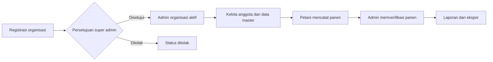

# TaniSync

<p align="center">
  
</p>

<p align="center">
  Platform digital multi-organisasi untuk pencatatan panen, pemantauan harga komoditas, dan pelaporan pertanian.
  <br>
  <em>A multi-organization digital platform for harvest records, commodity prices, and agricultural reporting.</em>
</p>

<p align="center">
  <a href="#bahasa-indonesia">Bahasa Indonesia</a> |
  <a href="#english">English</a>
</p>

---

## Bahasa Indonesia

### Tentang TaniSync

TaniSync adalah aplikasi web berbasis Laravel yang membantu organisasi pertanian seperti desa, kelompok tani, dan gapoktan mengelola data operasional dalam satu platform. Setiap organisasi memiliki ruang data terpisah untuk pengguna, komoditas, harga, catatan panen, dan laporan.

Platform ini menghubungkan tiga peran utama:

| Peran | Tanggung jawab |
| --- | --- |
| `super_admin` | Mengelola platform serta menyetujui atau menolak organisasi. |
| `admin` | Mengelola anggota, komoditas, harga, panen, laporan, dan audit organisasi. |
| `petani` | Melihat harga, mencatat hasil panen, dan memantau riwayat panen pribadi. |

### Fitur Utama

- **Manajemen multi-organisasi** dengan persetujuan organisasi oleh super admin.
- **Autentikasi berbasis role** dan status akun `pending`, `active`, atau `rejected`.
- **Isolasi data organisasi** untuk pengguna, komoditas, pasar, harga, dan panen.
- **Dashboard kontekstual** untuk super admin, admin, dan petani.
- **Manajemen komoditas** dengan pencarian, filter, serta status aktif/nonaktif.
- **Harga harian komoditas** berdasarkan pasar dan tanggal.
- **Pencatatan dan verifikasi panen** dengan status `menunggu`, `terverifikasi`, atau `butuh-review`.
- **Laporan terfilter** yang dapat dicetak atau diekspor ke PDF, XLSX, dan CSV.
- **Audit aktivitas** untuk tindakan penting di dalam organisasi.
- **Profil pengguna** serta alur reset dan pembaruan kata sandi.

### Alur Sistem



### Teknologi

| Area | Teknologi |
| --- | --- |
| Backend | PHP 8.2+, Laravel 12 |
| Frontend | Blade, Tailwind CSS, Alpine.js |
| Build tool | Vite 7 |
| Database | MySQL / MariaDB |
| Autentikasi | Laravel Breeze |
| Ekspor | DOMPDF, Laravel Excel |
| Pengujian | PHPUnit, Laravel Feature Test |

### Instalasi Lokal

#### Prasyarat

- PHP 8.2 atau lebih baru
- Composer
- Node.js dan npm
- MySQL atau MariaDB

#### Langkah instalasi

```bash
git clone https://github.com/Araff393/TaniSync.git
cd TaniSync
composer install
npm install
```

Salin konfigurasi environment dan buat application key:

```bash
cp .env.example .env
php artisan key:generate
```

> Pada Windows PowerShell, gunakan `Copy-Item .env.example .env` untuk menyalin file environment.

Buat database bernama `tanisync`, lalu sesuaikan koneksi berikut di `.env`:

```env
DB_CONNECTION=mysql
DB_HOST=127.0.0.1
DB_PORT=3306
DB_DATABASE=tanisync
DB_USERNAME=root
DB_PASSWORD=
```

Siapkan struktur database beserta data demo:

```bash
php artisan migrate:fresh --seed
```

Jalankan aplikasi dengan dua terminal:

```bash
# Terminal 1
php artisan serve

# Terminal 2
npm run dev
```

Aplikasi dapat dibuka melalui `http://127.0.0.1:8000`.

### Akun Demo Lokal

Seeder menyediakan akun berikut untuk pengembangan dan demonstrasi lokal:

| Peran | Email | Kata sandi |
| --- | --- | --- |
| Super Admin | `superadmin@tanisync.id` | `password123` |
| Admin | `admin@tanisync.id` | `password123` |
| Petani | `rahmat@tanisync.id` | `password123` |
| Petani | `sari@tanisync.id` | `password123` |

> Kredensial tersebut hanya untuk lingkungan lokal. Jangan gunakan kata sandi demo pada deployment produksi.

### Pengujian dan Build

```bash
# Menjalankan seluruh test
php artisan test

# Membuat asset frontend production
npm run build
```

Test mencakup autentikasi berbasis role, persetujuan akun dan organisasi, keamanan data petani, validasi harga dan panen, filter laporan, serta ekspor PDF, XLSX, dan CSV.

### Struktur Proyek

```text
app/
|-- Http/Controllers/   # Alur platform, admin, petani, dan autentikasi
|-- Models/             # Model organisasi, pengguna, komoditas, harga, dan panen
|-- Services/           # Pemrosesan harga dan laporan
database/
|-- migrations/         # Struktur database
|-- seeders/            # Data awal dan akun demo
resources/views/        # Antarmuka Blade berdasarkan role
routes/web.php          # Route utama aplikasi
tests/                  # Unit test dan feature test
```

### Status Pengembangan

TaniSync saat ini merupakan MVP capstone yang telah mencakup alur utama platform pertanian multi-organisasi. Pengembangan berikutnya dapat diarahkan pada notifikasi real-time, pengelolaan pasar dan kategori yang lebih lengkap, lampiran bukti panen, serta deployment produksi.

---

## English

### Overview

TaniSync is a Laravel-based, multi-organization agricultural management platform. It gives villages, farmer groups, and agricultural associations isolated workspaces for managing users, commodities, market prices, harvest records, reports, and activity logs.

### Core Capabilities

- Platform-level organization approval by a `super_admin`.
- Role-aware authentication for `super_admin`, `admin`, and `petani` users.
- Organization-scoped users, commodities, markets, prices, and harvest data.
- Commodity and daily market price management.
- Farmer harvest submission and administrator verification workflows.
- Filtered reports with print, PDF, XLSX, and CSV exports.
- Activity auditing and account approval states.
- Automated feature tests for core access and reporting workflows.

### Local Setup

```bash
git clone https://github.com/Araff393/TaniSync.git
cd TaniSync
composer install
npm install
cp .env.example .env
php artisan key:generate
```

Create a MySQL database named `tanisync`, update the database credentials in `.env`, and then run:

```bash
php artisan migrate:fresh --seed
php artisan serve
```

In a second terminal, start Vite:

```bash
npm run dev
```

Open `http://127.0.0.1:8000`. The local demo accounts are listed in the [Akun Demo Lokal](#akun-demo-lokal) section.

### Verification

```bash
php artisan test
npm run build
```

---

## Lisensi / License

Proyek ini dikembangkan untuk keperluan capstone dan pembelajaran. Periksa kebijakan repository sebelum menggunakan atau mendistribusikan kode di luar tujuan tersebut.

This project was developed for capstone and educational purposes. Review the repository policy before using or distributing it beyond those purposes.
